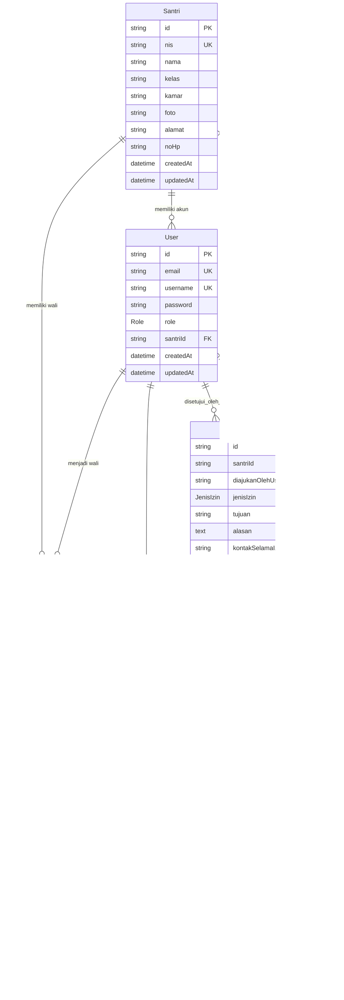

# ERD — SantriPermit

> **Referensi utama:** `PRD.md` §2 (User Roles), §3.2–§3.7 (Fitur), §4 (Workflow), §5 (Non-Fungsional), §6 (Arsitektur: MySQL + Prisma)
> **Schema eksisting:** `apps/api/prisma/schema.prisma`
> **Keputusan yang dikunci:** (1) Wali = tabel relasi `WaliSantri`, (2) DB = **MySQL** sesuai PRD, (3) Sertakan `AuditLog` + `qrToken` dengan label fase.

---

## 1. Ringkasan

SantriPermit memiliki 3 peran (PRD §2): **Santri**, **Wali Santri**, **Admin/Musyrif**. Inti proses (PRD §4):

`Santri/Wali mengajukan izin → notifikasi ke Admin → Admin review + approve/reject → notifikasi ke Wali → bukti izin digital → riwayat permanen`

Entitas inti ERD: `User`, `Santri`, `WaliSantri`, `Permission`, `Notification`, `AuditLog`.

---

## 2. Diagram ER (Mermaid)



---

## 3. Kamus Entitas

### 3.1 `User` — MVP (PRD §2, §3.1)

| Kolom | Tipe (MySQL / Prisma) | Null | Constraint | Keterangan |
|-------|------------------------|------|------------|------------|
| `id` | `VARCHAR(30)` / `String @id @default(cuid())` | NOT NULL | PK | ID internal |
| `email` | `VARCHAR(191)` | NOT NULL | UNIQUE | Login + notifikasi |
| `username` | `VARCHAR(50)` | NOT NULL | UNIQUE | Login (PRD §3.1) |
| `password` | `VARCHAR(255)` | NOT NULL | — | Hash (bcrypt/argon2), PRD §5 Keamanan |
| `role` | `ENUM('SANTRI','WALI','ADMIN')` | NOT NULL | DEFAULT `SANTRI` | Role-based access (PRD §2, §3.1) |
| `santriId` | `VARCHAR(30)` | NULL | FK → `Santri.id`, Index | Akun santri terhubung ke data santri; NULL untuk ADMIN / wali murni |
| `createdAt` | `TIMESTAMP` | NOT NULL | DEFAULT now() | Audit |
| `updatedAt` | `TIMESTAMP` | NOT NULL | Auto-update | Audit |

### 3.2 `Santri` — MVP (PRD §3.7)

| Kolom | Tipe | Null | Constraint | Keterangan |
|-------|------|------|------------|------------|
| `id` | `VARCHAR(30)` | NOT NULL | PK | |
| `nis` | `VARCHAR(30)` | NOT NULL | UNIQUE | Nomor Induk Santri |
| `nama` | `VARCHAR(100)` | NOT NULL | Index | |
| `kelas` | `VARCHAR(50)` | NOT NULL | Index | |
| `kamar` | `VARCHAR(50)` | NOT NULL | — | |
| `foto` | `VARCHAR(255)` | NULL | — | URL foto |
| `alamat` | `TEXT` | NULL | — | |
| `noHp` | `VARCHAR(20)` | NULL | — | Kontak santri |
| `createdAt` / `updatedAt` | `TIMESTAMP` | NOT NULL | — | |

### 3.3 `WaliSantri` — MVP, REKOMENDASI (PRD §2: Wali Santri)

Tabel pivot untuk relasi N wali ↔ 1 santri (mendukung ayah + ibu + wali lain).

| Kolom | Tipe | Null | Constraint | Keterangan |
|-------|------|------|------------|------------|
| `santriId` | `VARCHAR(30)` | NOT NULL | PK, FK → `Santri.id` ON DELETE CASCADE | |
| `waliUserId` | `VARCHAR(30)` | NOT NULL | PK, FK → `User.id` ON DELETE CASCADE | `User.role = WALI` (validasi level aplikasi) |
| `hubungan` | `VARCHAR(30)` | NOT NULL | — | `Ayah` / `Ibu` / `Wali` / dll. |

> Alternatif yang ditolak: kolom `namaWali/noHpWali` di `Santri` — tidak mendukung banyak wali dan tidak bisa login/notifikasi per wali.

### 3.4 `Permission` — MVP + Fase 3 (PRD §3.2, §3.3, §3.5, §3.6)

Satu baris = satu pengajuan izin.

| Kolom | Tipe | Null | Constraint | Sumber PRD |
|-------|------|------|------------|------------|
| `id` | `VARCHAR(30)` | NOT NULL | PK | — |
| `santriId` | `VARCHAR(30)` | NOT NULL | FK → `Santri.id` ON DELETE CASCADE, Index | Santri yang izin |
| `diajukanOlehUserId` | `VARCHAR(30)` | NOT NULL | FK → `User.id` | **[GAP]** PRD §3.2: pengaju bisa santri ATAU wali — harus dicatat siapa yang mengajukan |
| `jenisIzin` | `ENUM('PULANG','KELUAR','DARURAT','ACARA_KELUARGA')` | NOT NULL | Index | PRD §3.2 (schema lama hanya PULANG/KELUAR — perluas) |
| `tujuan` | `VARCHAR(255)` | NOT NULL | — | PRD §3.2 |
| `alasan` | `TEXT` | NOT NULL | — | PRD §3.2 |
| `kontakSelamaIzin` | `VARCHAR(30)` | NOT NULL | — | **[GAP]** PRD §3.2 "Kontak yang dapat dihubungi selama izin" |
| `penanggungJawabLuar` | `VARCHAR(100)` | NOT NULL | — | **[GAP]** PRD §3.2 "Penanggung jawab di luar pondok" |
| `tanggalKeluar` | `DATE` | NOT NULL | — | PRD §3.2 |
| `jamKeluar` | `VARCHAR(5)` | NOT NULL | Format `HH:MM` | PRD §3.2 (implisit) |
| `tanggalKembali` | `DATE` | NOT NULL | CHECK `>= tanggalKeluar` (app-level) | PRD §3.2 |
| `jamKembali` | `VARCHAR(5)` | NOT NULL | Format `HH:MM` | PRD §3.2 |
| `status` | `ENUM('MENUNGGU','DISETUJUI','DITOLAK','SEDANG_KELUAR','SUDAH_KEMBALI')` | NOT NULL | DEFAULT `MENUNGGU`, Index | PRD §3.3 + §4 |
| `rejectionReason` | `TEXT` | NULL | Wajib jika `status=DITOLAK` (app-level) | PRD §3.3 |
| `approvedById` | `VARCHAR(30)` | NULL | FK → `User.id` (role ADMIN) | PRD §3.3 |
| `approvedAt` | `TIMESTAMP` | NULL | — | Timestamp persetujuan (PRD §3.6) |
| `qrToken` | `VARCHAR(100)` | NULL | UNIQUE | **Fase 3** — PRD §3.5 QR verifikasi |
| `checkedOutAt` | `TIMESTAMP` | NULL | — | **Fase 3** — scan keluar |
| `checkedInAt` | `TIMESTAMP` | NULL | — | **Fase 3** — scan kembali |
| `createdAt` / `updatedAt` | `TIMESTAMP` | NOT NULL | Index `createdAt` | Riwayat permanen (PRD §3.6) |

### 3.5 `Notification` — MVP (in-app) + Fase 2 (WA) (PRD §3.4)

| Kolom | Tipe | Null | Constraint | Keterangan |
|-------|------|------|------------|------------|
| `id` | `VARCHAR(30)` | NOT NULL | PK | |
| `userId` | `VARCHAR(30)` | NOT NULL | FK → `User.id` ON DELETE CASCADE, Index | **[FIX]** schema lama String polos tanpa FK |
| `title` | `VARCHAR(150)` | NOT NULL | — | |
| `message` | `TEXT` | NOT NULL | — | |
| `isRead` | `BOOLEAN` | NOT NULL | DEFAULT false, Index | |
| `type` | `ENUM('new_request','approval','rejection')` | NULL | — | PRD §3.4: permohonan baru → admin; disetujui/ditolak → wali+santri |
| `relatedId` | `VARCHAR(30)` | NULL | FK → `Permission.id` ON DELETE SET NULL | **[FIX]** schema lama String polos |
| `createdAt` | `TIMESTAMP` | NOT NULL | — | |

> Notifikasi WA/SMS Gateway (PRD §3.4) adalah channel pengiriman, bukan tabel tambahan untuk MVP. Cukup kolom `type` + log di `AuditLog`.

### 3.6 `AuditLog` — Fase 2 (PRD §3.6, §5 Integritas Data)

| Kolom | Tipe | Null | Constraint | Keterangan |
|-------|------|------|------------|------------|
| `id` | `VARCHAR(30)` | NOT NULL | PK | |
| `permissionId` | `VARCHAR(30)` | NOT NULL | FK → `Permission.id` ON DELETE CASCADE, Index | |
| `actorUserId` | `VARCHAR(30)` | NOT NULL | FK → `User.id`, Index | Siapa yang melakukan aksi |
| `aksi` | `VARCHAR(50)` | NOT NULL | — | `DIAJUKAN / DISETUJUI / DITOLAK / CHECKOUT / CHECKIN / DIEKSPOR` |
| `catatan` | `TEXT` | NULL | — | Alasan penolakan, dsb. |
| `createdAt` | `TIMESTAMP` | NOT NULL | DEFAULT now() | Append-only (jangan update/delete) |

---

## 4. Relasi & Kardinalitas

| Relasi | Kardinalitas | FK / Aturan | Referensi PRD |
|--------|--------------|-------------|---------------|
| `Santri — User` (akun santri) | 1 : N | `User.santriId → Santri.id` | §2, §3.1 |
| `Santri — User(WALI)` via `WaliSantri` | N : M | Composite PK `(santriId, waliUserId)`, CASCADE dua sisi | §2 |
| `Santri — Permission` | 1 : N | `Permission.santriId → Santri.id` CASCADE | §3.2 |
| `User — Permission` (pengaju) | 1 : N | `Permission.diajukanOlehUserId → User.id` | §3.2 |
| `User(ADMIN) — Permission` (approver) | 1 : N | `Permission.approvedById → User.id` SET NULL | §3.3 |
| `User — Notification` | 1 : N | `Notification.userId → User.id` CASCADE | §3.4 |
| `Permission — Notification` | 1 : N | `Notification.relatedId → Permission.id` SET NULL | §3.4 |
| `Permission — AuditLog` | 1 : N | `AuditLog.permissionId → Permission.id` CASCADE | §3.6, §5 |

---

## 5. Lifecycle `StatusIzin` (PRD §3.3 + §4)

```
MENUNGGU → DISETUJUI → SEDANG_KELUAR → SUDAH_KEMBALI
MENUNGGU → DITOLAK (wajib rejectionReason)
```

| Transisi | Aktor | Efek samping |
|----------|-------|--------------|
| Pengajuan dibuat | Santri / Wali | `Permission(MENUNGGU)` + `Notification(new_request)` → Admin + `AuditLog(DIAJUKAN)` |
| Approve | Admin/Musyrif | `status=DISETUJUI`, `approvedById/approvedAt` diisi + `Notification(approval)` → Wali (+Santri) + `AuditLog(DISETUJUI)` |
| Reject | Admin/Musyrif | `status=DITOLAK`, `rejectionReason` wajib + `Notification(rejection)` → Wali & Santri + `AuditLog(DITOLAK)` |
| Checkout (Fase 3) | Petugas (scan QR) | `status=SEDANG_KELUAR`, `checkedOutAt` diisi |
| Checkin (Fase 3) | Petugas (scan QR) | `status=SUDAH_KEMBALI`, `checkedInAt` diisi |

---

## 6. Index & Constraint Ringkas

* UNIQUE: `User.email`, `User.username`, `Santri.nis`, `Permission.qrToken`
* INDEX: `User.santriId`, `Santri.nama`, `Santri.kelas`, `Permission(santriId, status, jenisIzin, createdAt)`, `Notification(userId, isRead)`, `AuditLog(permissionId, actorUserId)`
* Validasi level aplikasi: `tanggalKembali >= tanggalKeluar`, `rejectionReason` wajib saat DITOLAK, `approvedById` harus `role=ADMIN`, `WaliSantri.waliUserId` harus `role=WALI`.

---

## 7. Gap `schema.prisma` Saat Ini vs PRD

| # | Temuan | Aksi |
|---|--------|------|
| 1 | `datasource db provider = "postgresql"` | Ganti ke `"mysql"` sesuai PRD §6 |
| 2 | `Permission` belum ada `kontakSelamaIzin`, `penanggungJawabLuar`, `diajukanOlehUserId` | Tambah 3 kolom (lihat §3.4) |
| 3 | `enum JenisIzin` hanya `KELUAR/PULANG` | Tambah `DARURAT`, `ACARA_KELUARGA` |
| 4 | Tidak ada model `WaliSantri` / `Wali` | Buat model pivot `WaliSantri` |
| 5 | `Notification.userId` & `relatedId` String tanpa relasi | Jadikan FK ke `User` / `Permission` |
| 6 | Tidak ada `AuditLog` | Buat model `AuditLog` (append-only) |
| 7 | `Permission.qrToken` belum ada | Tambah `qrToken UNIQUE?` untuk Fase 3 |
| 8 | Better Auth (PRD §6) | Tabel `Session/Account` standar Better Auth dicatat sebagai out-of-scope ERD inti; jangan dicampur ke model bisnis |

---

## 8. Draf Revisi Prisma (MySQL, siap tempel)

```prisma
datasource db {
  provider = "mysql"
  url      = env("DATABASE_URL")
}

enum Role {
  SANTRI
  WALI
  ADMIN
}

enum JenisIzin {
  PULANG
  KELUAR
  DARURAT
  ACARA_KELUARGA
}

enum StatusIzin {
  MENUNGGU
  DISETUJUI
  DITOLAK
  SEDANG_KELUAR
  SUDAH_KEMBALI
}

enum TipeNotifikasi {
  new_request
  approval
  rejection
}

model User {
  id        String   @id @default(cuid())
  email     String   @unique
  username  String   @unique
  password  String
  role      Role     @default(SANTRI)
  santriId  String?
  santri    Santri?  @relation(fields: [santriId], references: [id])

  waliUntuk       WaliSantri[]   @relation("WaliRelasi")
  pengajuanDibuat Permission[]   @relation("PengajuIzin")
  persetujuan     Permission[]   @relation("ApproverIzin")
  notifikasi      Notification[]
  auditDilakukan  AuditLog[]

  createdAt DateTime @default(now())
  updatedAt DateTime @updatedAt

  @@index([santriId])
}

model Santri {
  id        String   @id @default(cuid())
  nis       String   @unique
  nama      String
  kelas     String
  kamar     String
  foto      String?
  alamat    String?  @db.Text
  noHp      String?

  users       User[]
  wali        WaliSantri[]
  permissions Permission[]

  createdAt DateTime @default(now())
  updatedAt DateTime @updatedAt

  @@index([nama])
  @@index([kelas])
}

model WaliSantri {
  santriId   String
  waliUserId String
  hubungan   String

  santri Santri @relation(fields: [santriId], references: [id], onDelete: Cascade)
  wali   User   @relation("WaliRelasi", fields: [waliUserId], references: [id], onDelete: Cascade)

  @@id([santriId, waliUserId])
}

model Permission {
  id                  String      @id @default(cuid())
  santriId            String
  santri              Santri      @relation(fields: [santriId], references: [id], onDelete: Cascade)
  diajukanOlehUserId  String
  diajukanOleh        User        @relation("PengajuIzin", fields: [diajukanOlehUserId], references: [id])

  jenisIzin           JenisIzin
  tujuan              String
  alasan              String      @db.Text
  kontakSelamaIzin    String
  penanggungJawabLuar String

  tanggalKeluar  DateTime @db.Date
  jamKeluar      String
  tanggalKembali DateTime @db.Date
  jamKembali     String

  status          StatusIzin @default(MENUNGGU)
  rejectionReason String?    @db.Text

  approvedById String?
  approvedBy   User?   @relation("ApproverIzin", fields: [approvedById], references: [id], onDelete: SetNull)
  approvedAt   DateTime?

  qrToken      String?   @unique
  checkedOutAt DateTime?
  checkedInAt  DateTime?

  notifikasi Notification[]
  auditLog   AuditLog[]

  createdAt DateTime @default(now())
  updatedAt DateTime @updatedAt

  @@index([santriId])
  @@index([status])
  @@index([jenisIzin])
  @@index([createdAt])
}

model Notification {
  id        String           @id @default(cuid())
  userId    String
  user      User             @relation(fields: [userId], references: [id], onDelete: Cascade)
  title     String
  message   String           @db.Text
  isRead    Boolean          @default(false)
  type      TipeNotifikasi?
  relatedId String?
  related   Permission?      @relation(fields: [relatedId], references: [id], onDelete: SetNull)
  createdAt DateTime         @default(now())

  @@index([userId])
  @@index([isRead])
}

model AuditLog {
  id           String     @id @default(cuid())
  permissionId String
  permission   Permission @relation(fields: [permissionId], references: [id], onDelete: Cascade)
  actorUserId  String
  actor        User       @relation(fields: [actorUserId], references: [id])
  aksi         String
  catatan      String?    @db.Text
  createdAt    DateTime   @default(now())

  @@index([permissionId])
  @@index([actorUserId])
}
```

---

## 9. Traceability ke PRD

| PRD | Entitas / Kolom ERD |
|-----|---------------------|
| §2 Roles | `User.role`, `Santri`, `WaliSantri` |
| §3.1 Auth | `User.email/username/password/role` |
| §3.2 Pengajuan | `Permission.*` (jenis, tanggal, alasan, kontak, penanggung jawab) |
| §3.3 Approval | `Permission.status/rejectionReason/approvedById/approvedAt` |
| §3.4 Notifikasi | `Notification.*` |
| §3.5 QR (Fase 3) | `Permission.qrToken/checkedOutAt/checkedInAt` |
| §3.6 Laporan & Riwayat | `Permission.createdAt/updatedAt` + `AuditLog` |
| §3.7 Data Santri | `Santri.*` + `WaliSantri` |
| §5 Audit trail | `AuditLog` (append-only) |
| §6 MySQL+Prisma | Tipe MySQL + draf Prisma §8 |
