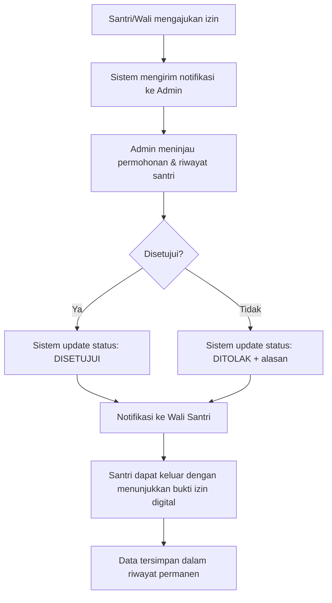

# Product Requirements Document (PRD) — SantriPermit

## 1. Pendahuluan

### 1.1 Latar Belakang

Saat ini, sebagian besar pondok pesantren masih mengelola proses perizinan pulang dan keluar santri secara manual — menggunakan buku izin kertas (BIS/Buku Izin Santri) yang harus dibawa santri dan ditandatangani oleh pengurus yang berwenang. Sistem manual ini menimbulkan sejumlah masalah: antrean panjang di pos keamanan, risiko kehilangan atau kerusakan dokumen, tidak adanya rekam jejak yang terstruktur, serta potensi pemalsuan surat izin. Selain itu, orang tua/wali santri seringkali tidak mendapat notifikasi ketika anaknya mendapatkan izin keluar.

**SantriPermit** hadir sebagai solusi digital berbasis web untuk mengelola proses perizinan pulang dan keluar santri secara lebih cepat, transparan, dan akuntabel.

### 1.2 Tujuan Produk

| Tujuan | Deskripsi |
|--------|-----------|
| **Efisiensi** | Mempercepat proses pengajuan dan persetujuan izin tanpa antrean fisik |
| **Transparansi** | Menyediakan status izin secara real-time bagi semua pihak terkait |
| **Akuntabilitas** | Menyimpan rekam jejak perizinan secara permanen dengan timestamp |
| **Komunikasi** | Mengirim notifikasi otomatis kepada wali santri saat izin disetujui |
| **Keamanan** | Mencegah pemalsuan izin melalui verifikasi digital |

### 1.3 Ruang Lingkup

SantriPermit adalah aplikasi web yang mencakup:
- Pengajuan izin pulang/keluar oleh santri atau wali
- Proses persetujuan oleh pengurus pondok (admin/musyrif)
- Notifikasi real-time ke wali santri
- Pelacakan dan riwayat perizinan
- Manajemen data santri dan pengguna

---

## 2. Pengguna (User Roles)

Berdasarkan studi sistem perizinan santri yang ada, SantriPermit melibatkan **tiga aktor utama**:

| Role | Deskripsi | Hak Akses Utama |
|------|-----------|-----------------|
| **Santri** | Santri yang mengajukan izin keluar/pulang | Mengajukan izin, melihat status, melihat riwayat izin sendiri |
| **Admin/Musyrif** | Pengurus pondok yang berwenang menyetujui/menolak izin | Mengelola data santri, memproses pengajuan izin, melihat seluruh riwayat |
| **Wali Santri** | Orang tua/wali santri | Mengajukan izin atas nama santri, menerima notifikasi, memantau riwayat izin anak |

---

## 3. Fitur Utama (High-Level Features)

### 3.1 Manajemen Akun & Autentikasi

| Fitur | Deskripsi |
|-------|-----------|
| Registrasi | Pendaftaran akun untuk santri dan wali (dikelola oleh admin) |
| Login | Masuk ke sistem menggunakan username dan password |
| Role-Based Access | Hak akses berbeda berdasarkan peran pengguna |
| Logout | Keluar dari sistem dan kembali ke halaman login |

### 3.2 Pengajuan Izin

Santri atau wali dapat mengajukan permohonan izin pulang/keluar dengan mengisi formulir digital yang mencakup:

- Jenis izin (pulang ke rumah, acara keluarga, kondisi darurat, dll.)
- Tanggal mulai dan tanggal selesai izin
- Alasan perizinan
- Kontak yang dapat dihubungi selama izin
- Penanggung jawab di luar pondok

### 3.3 Proses Persetujuan Izin

| Tahap | Deskripsi |
|-------|-----------|
| Notifikasi ke Admin | Musyrif/admin menerima notifikasi tentang permohonan izin baru |
| Review Riwayat | Admin dapat melihat riwayat izin santri (berapa kali izin, kapan terakhir izin) |
| Approve/Reject | Admin menyetujui atau menolak izin, dengan opsi menyertakan alasan penolakan |
| Status Real-Time | Status izin dapat dipantau secara langsung oleh semua pihak |

### 3.4 Notifikasi

| Jenis Notifikasi | Penerima | Trigger |
|------------------|----------|---------|
| Permohonan baru | Admin/Musyrif | Santri mengajukan izin |
| Izin disetujui | Wali Santri | Admin menyetujui izin |
| Izin ditolak | Wali Santri & Santri | Admin menolak izin |

Notifikasi dapat dikirim melalui WhatsApp API atau SMS Gateway.

### 3.5 Verifikasi Keamanan (Opsional - Fase Lanjutan)

Integrasi dengan **QR Code** untuk validasi izin di pintu keluar pesantren:
- Santri menampilkan QR Code dari aplikasi
- Petugas keamanan memindai untuk memverifikasi status izin

### 3.6 Laporan & Riwayat

| Fitur | Deskripsi |
|-------|-----------|
| Riwayat Izin Santri | Seluruh data perizinan tersimpan permanen dengan timestamp |
| Laporan Perizinan | Admin dan wali dapat melihat laporan izin yang diajukan dan disetujui |
| Ekspor Data | Ekspor laporan dalam format PDF/Excel |

### 3.7 Manajemen Data Santri (Admin)

Admin dapat mengelola data santri dan wali, termasuk menambah, mengedit, dan menghapus data.

---

## 4. Alur Kerja Utama (Core Workflow)



---

## 5. Kebutuhan Non-Fungsional

| Aspek | Kebutuhan |
|-------|-----------|
| **Keamanan** | Autentikasi pengguna, proteksi password, role-based access control |
| **Kinerja** | Response time < 3 detik; dapat menangani hingga 1000 pengguna simultan |
| **Ketersediaan** | Uptime 99% (kecuali jadwal maintenance) |
| **Kompatibilitas** | Responsif di desktop, tablet, dan mobile |
| **Integritas Data** | Backup database terjadwal; audit trail setiap transaksi izin |

---

## 6. Arsitektur Teknologi (Rekomendasi)

SantriPermit akan dibangun menggunakan arsitektur **monorepo modern** untuk memastikan skalabilitas, maintainability, dan konsistensi kode di seluruh tim pengembang.

| Layer | Teknologi | Keterangan |
|-------|-----------|------------|
| **Monorepo** | **Turborepo + Bun** | Mengelola kode dalam satu repositori terpusat (`apps/` dan `packages/`) dengan kecepatan eksekusi tinggi menggunakan Bun sebagai package manager dan runtime. |
| **Frontend** | **Next.js (App Router) + Tailwind CSS** | Framework React dengan dukungan SSR/SSG untuk performa optimal dan SEO yang baik. Tailwind CSS digunakan untuk membangun UI yang responsif, modern, dan konsisten. |
| **Backend API** | **NestJS** | Backend service terpisah yang dibangun dengan arsitektur modular (Modules, Controllers, Services) sehingga kode menjadi terstruktur, mudah diuji, dan siap untuk skalabilitas enterprise. |
| **ORM** | **Prisma** | ORM modern untuk interaksi dengan database. Menyediakan type-safety, auto-completion, dan migration management yang sangat mudah serta aman. |
| **Database** | **MySQL** | Database relasional yang stabil dan banyak digunakan, cocok untuk menyimpan data santri, wali, riwayat izin, serta transaksi log yang membutuhkan integritas data tinggi. |
| **Autentikasi** | **Better Auth** | Library autentikasi yang aman dan fleksibel. Mendukung session-based maupun JWT, dengan fitur bawaan seperti rate limiting, CSRF protection, dan integrasi yang mulus dengan Next.js serta NestJS. |
| **Kontainerisasi** | **Docker** | Mengemas seluruh aplikasi (frontend, backend, dan database) ke dalam container untuk menjamin lingkungan pengembangan dan produksi yang konsisten, serta mempermudah proses deployment. |

### Struktur Monorepo (Turborepo)

Dengan pendekatan monorepo, seluruh kode dikelola dalam satu proyek besar namun terpisah berdasarkan fungsinya:

```
santripermit/
├── apps/
│   ├── web/                      # Next.js (Frontend + BFF/Light API routes)
│   │   ├── app/                  # App Router (Pages & Layouts)
│   │   ├── components/           # UI Components (dengan Tailwind)
│   │   └── tailwind.config.js
│   └── api/                      # NestJS (Core Backend Service)
│       ├── src/
│       │   ├── modules/          # Modules (Auth, Izin, Santri, Wali)
│       │   ├── controllers/      # Request handlers
│       │   └── services/         # Business logic
│       └── prisma/               # Prisma schema & migrations
├── packages/
│   ├── database/                 # Shared Prisma Client & Schema
│   ├── auth/                     # Better Auth configuration (shared between apps)
│   └── types/                    # Shared TypeScript types/interfaces
├── docker-compose.yml            # Orchestration for MySQL, apps, etc.
├── turbo.json                    # Turborepo pipeline configuration
├── package.json                  # Workspace root (managed by Bun)
└── bun.lockb                     # Bun lockfile
```

Dengan arsitektur ini, pengembangan dapat dilakukan secara paralel antar tim, dependency dapat dikelola dengan rapi, dan deployment dapat dilakukan secara terpisah atau bersamaan menggunakan Docker Compose.

---

## 7. Matriks Prioritas Fitur (MVP vs Fase Lanjutan)

| Fitur | MVP | Fase 2 | Fase 3 |
|-------|-----|--------|--------|
| Login multi-role | ✓ | | |
| Pengajuan izin online | ✓ | | |
| Persetujuan/penolakan izin | ✓ | | |
| Notifikasi ke admin | ✓ | | |
| Riwayat izin | ✓ | | |
| Notifikasi ke wali (WA) | | ✓ | |
| Laporan & ekspor data | | ✓ | |
| QR Code verifikasi | | | ✓ |
| Manajemen data santri lengkap | | ✓ | |

---

## 8. Metrik Keberhasilan (Success Metrics)

| Metrik | Target |
|--------|--------|
| Waktu pemrosesan izin | Turun 80% dibandingkan sistem manual |
| Kepuasan pengguna (SUS Score) | ≥ 70 (kategori baik) |
| Pengurangan antrean fisik | 100% (semua pengajuan online) |
| Akurasi data izin | 100% (tanpa kehilangan data) |
| Adopsi pengguna | 90% santri dan admin menggunakan sistem dalam 3 bulan |

---

## 9. Risiko & Mitigasi

| Risiko | Mitigasi |
|--------|----------|
| Resistensi pengguna terhadap sistem digital | Sosialisasi dan pelatihan intensif; UI/UX yang intuitif |
| Koneksi internet tidak stabil di pesantren | Dukungan Progressive Web App (PWA) untuk akses offline |
| Keamanan data santri | Enkripsi data sensitif; backup rutin |
| Adopsi wali santri yang rendah | Notifikasi otomatis dan portal wali yang mudah diakses |

---

## 10. Kesimpulan

SantriPermit adalah solusi digital untuk mentransformasi proses perizinan santri dari sistem manual berbasis kertas menjadi sistem berbasis web yang **cepat, transparan, dan akuntabel**. Dengan mengakomodasi tiga peran utama (santri, admin, dan wali), aplikasi ini tidak hanya meningkatkan efisiensi operasional pesantren tetapi juga memperkuat komunikasi antara pondok dan orang tua santri.

---

